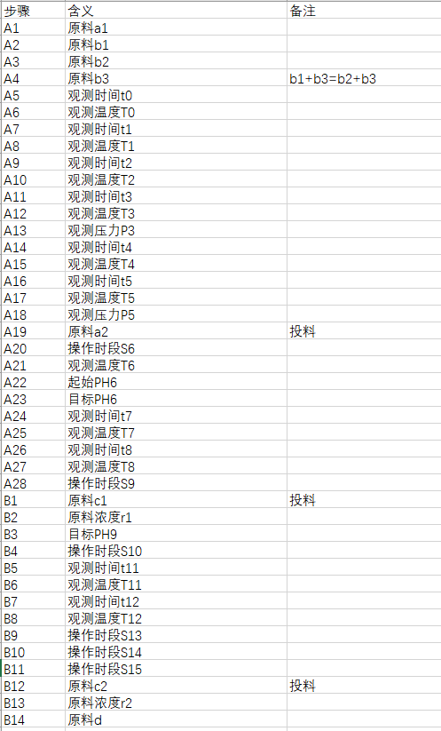
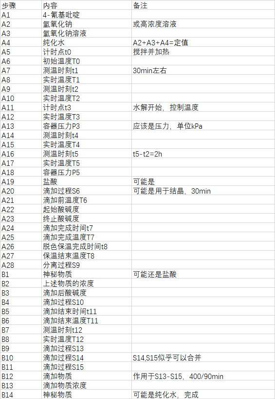

# project201901
The First Competition in 2019

---
#### Notes
- 原始数据在`/data`文件夹中,提交结果放在`/data/result`
- 通用函数在`/lib`中:
	- 所有常量在`constants.py`
	- 基本数据清洗在`datacleaning.py`
	- 数据读写/分割在`dataio.py`,该文件中定义了通用的存放train/validation/test的数据结构,供模型使用
- `/model`中存放所有可行的模型
- `/testbox`自由发挥,jupyter文件等
- `piplinedong`/`piplineduan`应写整个数据流的pipline,即main

---
#### Request
python 3.5
python packages:
	- lightGBM
	- XGBoost
	- sklearn

---
#### BaseLine

   - 字段A25中有异常值,已单独处理
   - 目前时间戳/时间区间当做离散特征进行处理,以LabelEncoder进行编码
   - 时间类字段的缺失值以字符串`None`进行填充
   - baseline中用到了lgb和xgb, 线下lgb效果好
   
   线下lgb: training's l2: 0.000203694	valid_1's l2: 0.000281226
   线上:0.000172
   
   线下xgb: train-rmse:0.011531	vali-rmse:0.019238
 ---
#### Todo List
- [X]区分度小的特征剔除: A2,A18只有两个维度,去掉后线下评分降低(0.000502539),先留着保证信息量完整
- [ ]时间特征异常值修复/填充
- [ ]数值特征缺失值填充
- [ ]特征之间关系
- [ ]数值特征做升维/分箱
- [X]特征编码方式研究: onehot 比labelencoder效果好
- [ ]离散特征embedding
- [ ]NN模型测试 